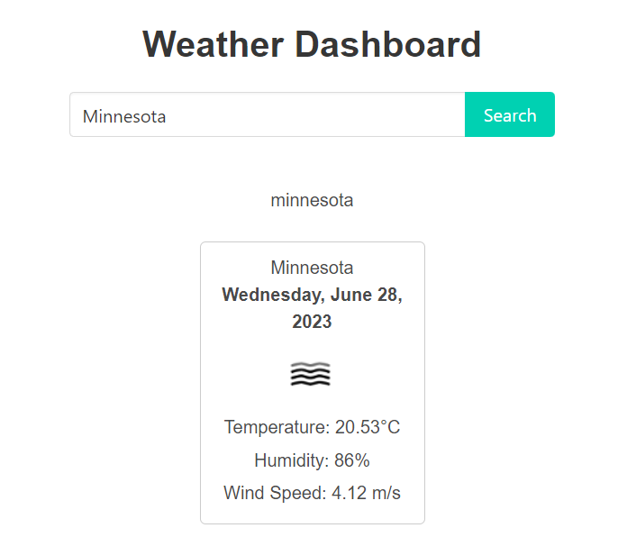
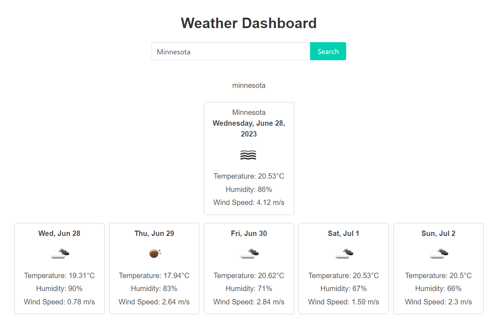
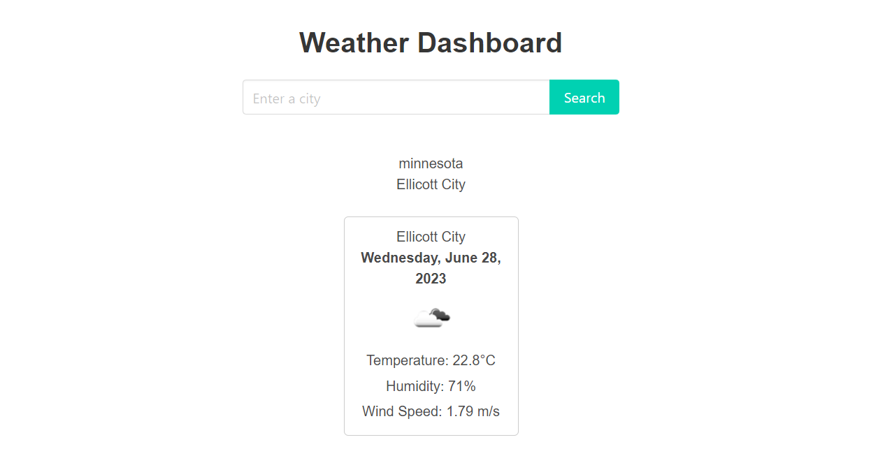

# Weather Dashboard

This is a weather dashboard application that allows users to search for cities and view current and future weather conditions. It also maintains a search history for easy access to previously searched cities.

## Features

- Search for a city to view current and future weather conditions.
- Display the city name, date, weather icon, temperature, humidity, and wind speed for the current weather.
- Show a 5-day forecast with the date, weather icon, temperature, wind speed, and humidity.
- Click on a city in the search history to view its current and future weather conditions again.

## Usage

1. Enter the name of a city in the search input field.

2. Click the search button or press Enter to fetch and display the current and future weather conditions for the entered city.

3. The current weather section will show the city name, date, weather icon, temperature, humidity, and wind speed.

4. The forecast section will display a 5-day forecast with the date, weather icon, temperature, wind speed, and humidity for each day.

5. The searched city will be added to the search history section for quick access in the future.
6. To view the weather conditions for a city from the search history, click on the city name in the search history section.

## Technologies Used

- HTML
- CSS
- JavaScript
- OpenWeatherMap API

## Getting Started

To use the weather dashboard locally, follow these steps:

1. Clone this repository to your local machine.
2. Open the project folder in a code editor of your choice.
3. Open the `index.html` file in a web browser.
4. Start searching for cities and view the weather conditions!

Please note that an internet connection is required to fetch weather data from the OpenWeatherMap API.

## Credits

- The weather data is provided by the [OpenWeatherMap API](https://openweathermap.org/api).
- Weather icons are sourced from the [OpenWeatherMap Weather Conditions](https://openweathermap.org/weather-conditions) documentation.

## License

This project is licensed under the [MIT License](LICENSE).